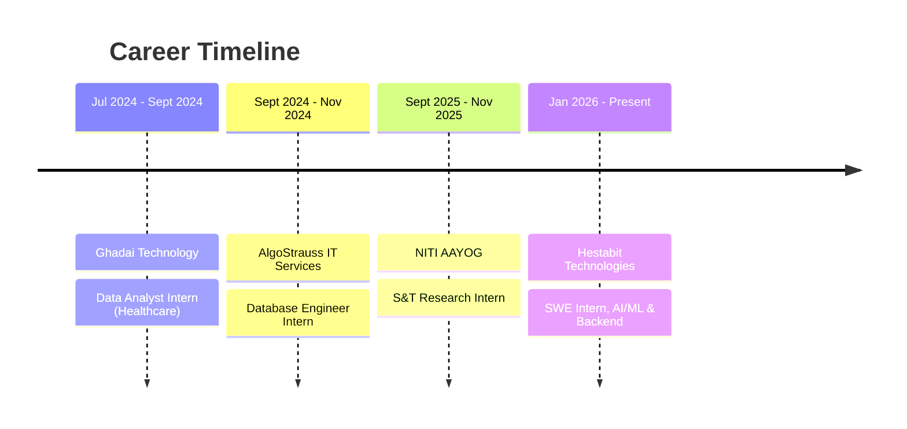

<div align="center">

<!-- Animated Header Banner -->


<!-- Typing Animation -->
[](https://git.io/typing-svg)

<br/>

<!-- Social + Status Badges -->
[](https://github.com/Prateeksingh84)


<br/><br/>


</div>


## 🧬 About Me

<table>
<tr>
<td width="55%" valign="top">

```python
prateek = {
    "name"       : "Prateek Singh",
    "role"       : "AI/ML Engineer | GenAI Developer | Software Engineer",
    "education"  : "B.Tech CSE (DSAI) @ SRM University, Delhi-NCR",
    "cgpa"       : 8.5,
    "location"   : "New Delhi, India 🇮🇳",
    "languages"  : ["English", "Hindi (Fluent)", "German (Working)"],
    "currently"  : "SWE Intern @ Hestabit Technologies Pvt. Ltd.",
    "focus"      : ["Generative AI", "RAG Pipelines",
                     "Multi-Agent Systems", "LLM Apps",
                     "ML Engineering", "Data Analytics"],
    "open_to"    : ["Internships", "Full-time Roles",
                     "Collaborations", "Open Source"]
}

print(prateek["role"])
# >> AI/ML Engineer | GenAI Developer | Software Engineer
```

</td>
<td width="45%" valign="top" align="center">


<sub>🤖 AI/ML in motion</sub>

</td>
</tr>
</table>

<table>
<tr><td>

🚀 &nbsp;I'm currently working on **AI/ML projects, backend systems, automation workflows**, and real-world data-driven applications.

👯 &nbsp;I'm looking to collaborate on **AI-powered products, machine learning dashboards, full-stack web apps, automation systems**, and open-source projects.

🤝 &nbsp;I'm looking for help with **advanced MLOps, scalable AI deployment, cloud infrastructure**, and production-level system design.

🌱 &nbsp;I'm currently learning **Deep Learning, PyTorch, TensorFlow, MLOps, FastAPI, Docker, Kubernetes**, and advanced Data Structures & Algorithms.

💬 &nbsp;Ask me about **Python, Machine Learning, AI/ML, Data Science, SQL, FastAPI, Flask, Power BI**, automation workflows, and project development.

⚡ &nbsp;Fun fact: I enjoy turning ideas into **real-world AI projects, dashboards, and automation systems** that solve practical problems.

</td></tr>
</table>

> *"Data is the new oil — but only if you can refine it."*


## 💼 Work Experience


<table>
<tr><td>


### 🏢 Hestabit Technologies Pvt. Ltd.
**Software Engineer Intern, AI/ML & Backend** &nbsp;·&nbsp; `Jan 2026 – Present`

- 🤖 Built **production-style AI & backend modules** using Python, REST APIs, RAG pipelines, embeddings, and LLM workflows
- 🛡️ Engineered **cybersecurity data-processing pipelines** on NF-UQ-NIDS-v2 network traffic datasets for anomaly detection & traffic pattern analysis
- ⚡ Reduced **decision-making latency by 30%** through automated analytics workflows and KPI-ready dashboards
- 🔁 Applied **Git workflows, Docker deployments & CI/CD concepts** across sprint-based development cycles

</td></tr>
<tr><td>


### 🏛️ NITI AAYOG (Ministry of Home Affairs)
**S&T Research Intern, Data Automation & Analytics** &nbsp;·&nbsp; `Sept 2025 – Nov 2025`

- 📊 Built **Power BI & Excel dashboards** tracking S&T budgets, innovation programs & policy indicators for *"India's S&T Landscape 2025"*
- 🤖 **Automated extraction, cleaning & normalization** of multi-departmental datasets via Python — cutting manual effort by **50%**
- 📝 Translated stakeholder requirements into structured analytical workflows and policy-ready documentation

</td></tr>
<tr><td>


### 🗄️ AlgoStrauss IT Services and Consulting LLP
**Database Engineer Intern** &nbsp;·&nbsp; `Sept 2024 – Nov 2024`

- ⚙️ Optimized **SQL workflows across 100K+ records** via query refactoring, joins, subqueries & indexing
- 🚀 Improved **query response time by 20%** and strengthened reporting reliability
- 📑 Documented SQL logic and validation rules for maintainable, team-ready data workflows

</td></tr>
<tr><td>


### 🔬 Ghadai Technology
**Data Analyst Intern, Healthcare Analytics (Hybrid)** &nbsp;·&nbsp; `Jul 2024 – Sept 2024`

- 🏥 Built **Python validation workflows** across 5+ healthcare datasets, improving data integrity by **25%**
- 📉 Developed **KPI dashboards** using Power BI/Tableau for stakeholder decision-making
- 🔍 Applied data cleaning & anomaly detection techniques for structured healthcare reporting

</td></tr>
</table>

<details>
<summary align="center"><b>🗓️ View as Timeline</b></summary>



</details>


## 🚀 Featured Projects


<table>
  <tr>
    <td width="50%">
      <h3>🧠 NeuroSense AI — Mental Wellness Companion</h3>
      <p>Multimodal AI wellness platform using <b>Flask, Supabase, Groq & Ollama</b> with <b>DeepFace</b> emotion detection (85% accuracy), mood analytics & a multi-agent safety layer for crisis-aware, sign-language & voice interactions.</p>
      
      
      
      
      
    </td>
    <td width="50%">
      <h3>🔁 Scrap Simulation — Real-Time ML Pipeline</h3>
      <p>Production-style classification pipeline using <b>PyTorch, ResNet18 & ONNX</b> achieving <b>94% accuracy</b> across 5 scrap categories. Reduced inference latency by 25% and containerized with Docker for reproducible edge deployment.</p>
      
      
      
      
    </td>
  </tr>
  <tr>
    <td width="50%">
      <h3>🤖 n8n Multi-Agent Workflow Dashboard</h3>
      <p>Self-hosted <b>agentic AI platform</b> automating Gmail/WhatsApp support with an agent swarm (Classifier, Researcher, Qualifier, Executor) using <b>n8n, Ollama & Supabase</b>. Includes execution tracing, bottleneck detection & 100+ automated test cases.</p>
      
      
      
      
    </td>
    <td width="50%">
      <h3>🎥 Zoomly Meetings — Full-Stack Video Platform</h3>
      <p>Production-inspired Zoom clone with <b>WebRTC P2P mesh</b>, <b>FastAPI WebSocket</b> signaling, real-time group chat, host controls (mute all, remove participant), screen sharing & meeting scheduling. Built with Next.js 14, TypeScript, SQLite & Docker.</p>
      
      
      
      
      
      
    </td>
  </tr>
  <tr>
    <td width="50%">
      <h3>⚡ High-Concurrency Data Ingestion Engine</h3>
      <p>Enterprise-style <b>Java ingestion engine</b> using ExecutorService & ConcurrentHashMap for high-volume async processing. Thread-safe JDBC batch pipelines ensure ACID compliance with robust retry/error-handling for mission-critical streams.</p>
      
      
      
      
    </td>
    <td width="50%">
      <h3>🗂️ GH-Timeline — Activity Tracking System</h3>
      <p>Repository tracking platform using <b>GitHub API & MySQL</b> to monitor commits, PRs & productivity metrics, with automated <b>CRON + SMTP</b> contribution alerts for improved sprint visibility.</p>
      
      
      
      
    </td>
  </tr>
  <tr>
    <td width="50%">
      <h3>📚 Automated Book Publication Workflow</h3>
      <p>ML pipeline using <b>Python, Gemini AI & ChromaDB</b> with SVM, Logistic Regression & Decision Trees — evaluated via accuracy scores & confusion matrices.</p>
      
      
      
      
    </td>
    <td width="50%" align="center" valign="middle">
      <br/>
      
      <p><i>🧪 Research paper (under review) — see below ⬇️</i></p>
    </td>
  </tr>
</table>

<div align="center">

> 🧪 **Research (Under Review):** *Multimodal Agentic AI Platform for Mental Wellness Analytics* — exploring emotion-aware interaction, agentic workflows, persistent memory & responsible AI-based support systems.

</div>


## 🛠️ Tech Stack

<div align="center">

**🤖 AI / LLM / Agentic Systems**


<br/><br/>

**🧠 Machine Learning / Deep Learning**


<br/><br/>


<br/><br/>

**⚙️ Backend, APIs & Frameworks**


<br/><br/>


<br/><br/>

**🎨 Frontend**


<br/><br/>


<br/><br/>

**📊 Data, BI & Databases**


<br/><br/>


<br/><br/>

**💻 Core Languages**


<br/><br/>


<br/><br/>

**☁️ Cloud, DevOps & Tools**


<br/><br/>


<br/><br/>

**🧪 Testing, Automation & IoT**


<br/><br/>

**🖌️ Design & Productivity**


</div>


## 📊 GitHub Stats & Activity

<div align="center">


<br/>


<br/>

<sub>ℹ️ Stats/top-languages use the <code>shion.dev</code> community mirror of github-readme-stats (more stable than the default Vercel instance). The trophy card still calls <code>github-profile-trophy.vercel.app</code>, which can occasionally rate-limit — if it goes blank, wait a few minutes or self-host your own instance via the button below:</sub>

<br/><br/>

[](https://github.com/anuraghazra/github-readme-stats#deploy-on-your-own-vercel-instance)

</div>

<div align="center">

### 📈 Activity Graph


</div>

<div align="center">

### 🐍 Contribution Snake

<picture>
  <source media="(prefers-color-scheme: dark)" srcset="https://raw.githubusercontent.com/Prateeksingh84/Prateeksingh84/output/github-snake-dark.svg" />
  <source media="(prefers-color-scheme: light)" srcset="https://raw.githubusercontent.com/Prateeksingh84/Prateeksingh84/output/github-snake.svg" />
  
</picture>

<sub>✅ Refreshes automatically every 6 hours via GitHub Actions once set up:</sub>

<br/>

<sub>1️⃣ Create a repo named exactly <code>Prateeksingh84/Prateeksingh84</code><br/>
2️⃣ Add the workflow file at <code>.github/workflows/snake.yml</code> (the <code>snake.yml</code> provided alongside this README)<br/>
3️⃣ Go to the repo's <b>Actions</b> tab → run <b>"Generate Snake Animation"</b> once manually<br/>
4️⃣ It creates an <code>output</code> branch with <code>github-snake.svg</code> — after that it self-refreshes every 6 hours</sub>

</div>


## 🎓 Certifications

<div align="center">

| 🏅 Certificate | 🏢 Issuer |
|:---|:---|
| 🧠 OCI Data Science Professional | Oracle |
| 🤖 Artificial Intelligence Analyst | IBM |
| 💬 Technovate 2.0: Build Your Own Chatbots | IBM |
| 📊 Machine Learning Using R | IBM |
| 🗃️ Introduction to Big Data, Hadoop and the Ecosystems | — |
| 📈 Data Analytics Job Simulation | Deloitte Australia – Forage |
| 🔬 Oracle Professional: Data Science | Oracle |

</div>

<div align="center">

**🧭 Relevant Learning**


</div>


## 🏅 Responsibilities & Leadership

<div align="center">

| Role | Organization | Duration |
|:---|:---|:---|
| 🎯 **Vice President** | AILYTICS CLUB, SRMUH | `2025 – 2026` |
| 🎪 **Head of Events & Management** | E-CELL, SRMUH | `2024 – 2025` |
| 🪖 **CDT** | NCC 12 HR BT | `2022 – 2025` |

<sub>Led AI workshops, hackathons & mentoring initiatives for 100+ students</sub>

</div>


## 🌐 Let's Connect

<div align="center">

[](https://instagram.com/singh_prateek0102)
[](https://linkedin.com/in/prateeksingh05)
[](https://x.com/PRATEEK01022003)
[](https://github.com/Prateeksingh84)
[](mailto:prathamgsingh@gmail.com)

<br/>


<br/>


</div>


<div align="center">
<i>"Every dataset tells a story. I make sure it's worth reading."</i>
</div>