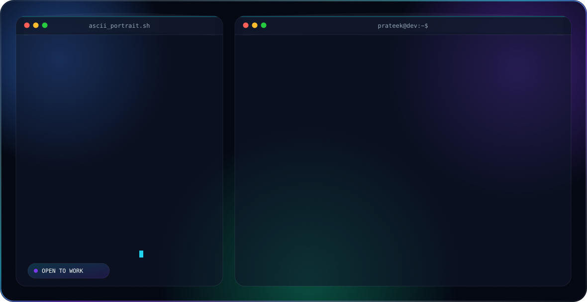



<!-- Premium Animated Hero Banner (dark/light aware) -->
<picture>
  <source media="(prefers-color-scheme: dark)" srcset="./dark.svg" />
  <source media="(prefers-color-scheme: light)" srcset="./light.svg" />
  
</picture>

 

  

## 📊 GitHub Stats & Activity

<table>
<tr>
<td align="center" width="25%">
<h3>324+</h3>
<b>Total Contributions</b> 
Building consistently across AI/ML, backend, data, and automation projects
</td>
<td align="center" width="25%">
<h3>AI/ML</h3>
<b>Primary Focus</b> 
GenAI, RAG, ML Engineering, Data Analytics
</td>
<td align="center" width="25%">
<h3>Python</h3>
<b>Core Language</b> 
FastAPI, Flask, Pandas, NumPy, Scikit-learn
</td>
<td align="center" width="25%">
<h3>2026</h3>
<b>B.Tech CSE</b> 
Data Science & AI specialization
</td>
</tr>
</table>

 

<table>
<tr>
<td align="center" width="33%">
<b>🚀 Featured Work</b> 
NeuroSense AI 
n8n Multi-Agent Platform 
Zoomly Meetings
</td>
<td align="center" width="33%">
<b>🧠 AI Stack</b> 
LLM/RAG 
Prompt Engineering 
Agentic AI
</td>
<td align="center" width="33%">
<b>⚙️ Engineering Stack</b> 
FastAPI / Flask 
SQL / Supabase 
Docker / GitHub
</td>
</tr>
</table>

 

### 🐍 Contribution Snake

<picture>
  <source media="(prefers-color-scheme: dark)" srcset="https://raw.githubusercontent.com/Prateeksingh84/Prateeksingh84/output/github-snake-dark.svg" />
  <source media="(prefers-color-scheme: light)" srcset="https://raw.githubusercontent.com/Prateeksingh84/Prateeksingh84/output/github-snake.svg" />
  
</picture>

Refreshes automatically via GitHub Actions after the snake workflow creates the output branch.

### 📈 Activity Graph

### 🐍 Contribution Snake

<picture>
  <source media="(prefers-color-scheme: dark)" srcset="https://raw.githubusercontent.com/Prateeksingh84/Prateeksingh84/output/github-snake-dark.svg" />
  <source media="(prefers-color-scheme: light)" srcset="https://raw.githubusercontent.com/Prateeksingh84/Prateeksingh84/output/github-snake.svg" />
  
</picture>

Refreshes automatically via GitHub Actions after the snake workflow creates the output branch.

### 📈 Activity Graph

### 🐍 Contribution Snake

<picture>
  <source media="(prefers-color-scheme: dark)" srcset="https://raw.githubusercontent.com/Prateeksingh84/Prateeksingh84/output/github-snake-dark.svg" />
  <source media="(prefers-color-scheme: light)" srcset="https://raw.githubusercontent.com/Prateeksingh84/Prateeksingh84/output/github-snake.svg" />
  
</picture>

Refreshes automatically via GitHub Actions from <code>.github/workflows/snake.yml</code>.

## 🎓 Certifications

| 🏅 Certificate | 🏢 Issuer |
|:---|:---|
| 🧠 OCI Data Science Professional | Oracle |
| 🤖 Artificial Intelligence Analyst | IBM |
| 💬 Technovate 2.0: Build Your Own Chatbots | IBM |
| 📊 Machine Learning Using R | IBM |
| 🗃️ Introduction to Big Data, Hadoop and the Ecosystems | — |
| 📈 Data Analytics Job Simulation | Deloitte Australia – Forage |
| 🔬 Oracle Professional: Data Science | Oracle |

## 🏅 Responsibilities & Leadership

| Role | Organization | Duration |
|:---|:---|:---|
| 🎯 **Vice President** | AILYTICS Club, SRMUH | `2025 – 2026` |
| 🎪 **Head of Events & Management** | E-CELL, SRMUH | `2024 – 2025` |
| 🪖 **Senior NCC Cadet** | NCC 12 HR Battalion | `2022 – 2025` |

Led AI workshops, hackathons, event operations, and mentoring initiatives for 100+ students.

## 🌐 Let's Connect

 

 

<i>"Every dataset tells a story. I build systems that help people understand it."</i>

