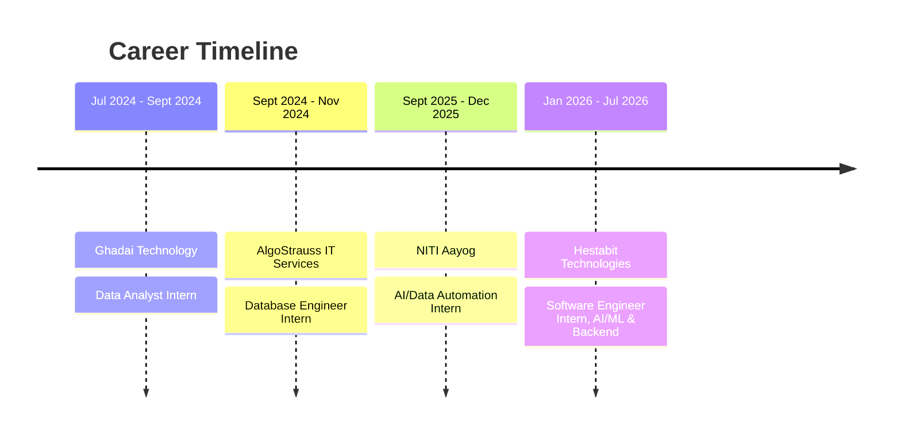

<div align="center">

<!-- Premium Animated Hero Banner (dark/light aware) -->
<picture>
  <source media="(prefers-color-scheme: dark)" srcset="./dark.svg" />
  <source media="(prefers-color-scheme: light)" srcset="./light.svg" />
  
</picture>

<br/>

[](https://github.com/Prateeksingh84)


<br/><br/>


</div>


## 🧬 About Me

<table>
<tr>
<td width="58%" valign="top">

```python
prateek = {
    "name"      : "Prateek Singh",
    "role"      : "Software Developer (AI/ML) | GenAI Developer | Data Science & AI",
    "education" : "B.Tech CSE (Data Science & AI) @ SRM University Delhi-NCR",
    "cgpa"      : 8.5,
    "location"  : "New Delhi, India 🇮🇳",
    "focus"     : [
        "Generative AI", "RAG Pipelines", "AI Agents",
        "Backend APIs", "Data Analytics", "ML Engineering"
    ],
    "open_to"   : [
        "Software Engineer (AI/ML)", "AI/GenAI Engineer",
        "Data Engineer / Analyst", "Open Source Collaboration"
    ]
}

print(prateek["role"])
# >> Software Developer (AI/ML) | GenAI Developer | Data Science & AI
```

</td>
<td width="42%" valign="top" align="center">


<sub>Turning ideas into deployable AI systems.</sub>

</td>
</tr>
</table>

<table>
<tr><td>

🚀 I build **AI/ML products, backend APIs, RAG systems, automation workflows, dashboards, and data-driven applications**.  
🤖 I enjoy working with **LLMs, AI agents, prompt engineering, Python, FastAPI, Flask, SQL, Supabase, Docker, and Power BI**.  
📊 I focus on **clean data, reliable APIs, model evaluation, technical documentation, and production-style engineering practices**.  
🌱 Currently strengthening **MLOps, scalable AI deployment, cloud infrastructure, system design, and advanced DSA**.  
💬 Ask me about **AI/ML projects, GenAI workflows, RAG pipelines, backend systems, SQL, data analytics, and automation**.

</td></tr>
</table>

> *"Build systems that are useful, reliable, and understandable."*


## 💼 Work Experience

<table>
<tr><td>


### 🏢 Hestabit Technologies Pvt. Ltd.
**Software Engineer Intern — AI/ML & Backend Workflows** &nbsp;·&nbsp; `Jan 2026 – Jul 2026`

- 🤖 Built **AI-powered backend workflows, REST API components, SQL validation flows, structured JSON outputs, and LLM/RAG-style modules** using Python, FastAPI, Flask, and database-driven logic.
- 📈 Improved workflow reliability and reduced operational decision latency by **30%** through execution tracing, structured logs, retry/fallback logic, debugging, and response-quality checks.
- 🛡️ Worked on cybersecurity analytics and data-processing workflows using network traffic datasets, automation pipelines, and KPI-ready outputs.

</td></tr>
<tr><td>


### 🏛️ NITI Aayog, Government of India
**AI/Data Automation Intern — Analytics & Reporting** &nbsp;·&nbsp; `Sept 2025 – Dec 2025`

- 📊 Built **Power BI and Excel reporting workflows** for technology indicators, innovation programs, and stakeholder-facing summaries.
- 🧹 Automated **data cleaning, normalization, validation, and reporting workflows**, reducing manual preparation effort by **50%**.
- 📝 Converted multi-source datasets into structured schemas, dashboard-ready outputs, and policy-ready documentation.

</td></tr>
<tr><td>


### 🗄️ AlgoStrauss IT Services and Consulting LLP
**Database Engineer Intern** &nbsp;·&nbsp; `Sept 2024 – Nov 2024`

- ⚙️ Optimized **SQL workflows across 100K+ records** using joins, subqueries, indexing, and query refactoring.
- 🚀 Improved query response time by **20%** and strengthened reporting reliability through validation rules.
- 📑 Documented SQL logic, data checks, and maintainable reporting workflows for team use.

</td></tr>
<tr><td>


### 🔬 Ghadai Technology
**Data Analyst Intern — Healthcare Analytics** &nbsp;·&nbsp; `Jul 2024 – Sept 2024`

- 🏥 Prepared **analysis-ready and model-ready healthcare datasets** using Python, SQL, Pandas, NumPy, EDA, anomaly detection, and preprocessing.
- ✅ Improved data integrity by **25%** through SQL validation, feature checks, and data-quality workflows.
- 📉 Developed KPI dashboards using Power BI/Tableau for stakeholder decision-making and structured healthcare reporting.

</td></tr>
</table>

<details>
<summary align="center"><b>🗓️ View Career Timeline</b></summary>


```mermaid
timeline
    title Career Timeline
    Jul 2024 - Sept 2024 : Ghadai Technology
                          : Data Analyst Intern
    Sept 2024 - Nov 2024 : AlgoStrauss IT Services
                          : Database Engineer Intern
    Sept 2025 - Dec 2025 : NITI Aayog
                          : AI/Data Automation Intern
    Jan 2026 - Jul 2026  : Hestabit Technologies
                          : Software Engineer Intern, AI/ML & Backend
```

</details>


## 🚀 Featured Projects

<table>
  <tr>
    <td width="50%">
      <h3>🧠 NeuroSense AI — Mental Wellness Companion</h3>
      <p>Multimodal AI wellness platform using <b>Flask, Supabase, Groq/Ollama</b>, RAG-style workflows, mood analytics, emotion-aware responses, and a safety-focused AI layer.</p>
      <a href="https://github.com/Prateeksingh84/NeuroSense-AI"></a>
      <br/><br/>
      
      
      
      
    </td>
    <td width="50%">
      <h3>🤖 n8n Multi-Agent Workflow Dashboard</h3>
      <p>Agentic workflow platform using <b>n8n, Ollama, Supabase, webhooks, structured JSON, retry/fallback logic</b>, execution tracing, and reusable workflow templates.</p>
      <a href="https://github.com/Prateeksingh84/N8N_INQUIRY_PLATFORM"></a>
      <br/><br/>
      
      
      
      
    </td>
  </tr>
  <tr>
    <td width="50%">
      <h3>🎥 Zoomly Meetings — Full-Stack Video Platform</h3>
      <p>Production-inspired video conferencing platform with <b>WebRTC P2P mesh</b>, FastAPI WebSocket signaling, real-time chat, host controls, screen sharing, scheduling, and Docker support.</p>
      <a href="https://github.com/Prateeksingh84/Zoomly-Meetings"></a>
      <br/><br/>
      
      
      
      
    </td>
    <td width="50%">
      <h3>⚡ High-Concurrency Data Ingestion Engine</h3>
      <p>Enterprise-style Java ingestion engine using <b>ExecutorService, ConcurrentHashMap, JDBC batch pipelines</b>, retry/error handling, and ACID-compliant database workflows.</p>
      
      
      
      
    </td>
  </tr>
  <tr>
    <td width="50%">
      <h3>📚 Automated Book Publication Workflow</h3>
      <p>ML and GenAI pipeline using <b>Python, Gemini AI, ChromaDB</b>, classification models, accuracy reports, confusion matrices, and reproducible experiment workflows.</p>
      
      
      
      
    </td>
    <td width="50%">
      <h3>🗂️ GH-Timeline — Activity Tracking System</h3>
      <p>Repository tracking platform using <b>GitHub API, MySQL, CRON, and SMTP</b> to monitor commits, PRs, productivity metrics, and automated contribution alerts.</p>
      
      
      
      
    </td>
  </tr>
</table>

<div align="center">

> 🧪 **Research Focus:** Multimodal Agentic AI for mental wellness analytics, emotion-aware interaction, memory, RAG, and responsible AI-based support systems.

</div>


## 🛠️ Tech Stack

<div align="center">

**🤖 AI / LLM / Agentic Systems**


<br/><br/>

**🧠 Machine Learning / Deep Learning**


<br/><br/>


<br/><br/>

**⚙️ Backend, APIs & Frameworks**


<br/><br/>


<br/><br/>

**🎨 Frontend**


<br/><br/>


<br/><br/>

**📊 Data, BI & Databases**


<br/><br/>


<br/><br/>

**☁️ Cloud, DevOps & Tools**


<br/><br/>


</div>


## 📊 GitHub Stats & Activity

<div align="center">


<br/>


</div>

<div align="center">

### 📈 Activity Graph


</div>

<div align="center">

### 🐍 Contribution Snake

<picture>
  <source media="(prefers-color-scheme: dark)" srcset="https://raw.githubusercontent.com/Prateeksingh84/Prateeksingh84/output/github-snake-dark.svg" />
  <source media="(prefers-color-scheme: light)" srcset="https://raw.githubusercontent.com/Prateeksingh84/Prateeksingh84/output/github-snake.svg" />
  
</picture>

<sub>Refreshes automatically via GitHub Actions from <code>.github/workflows/snake.yml</code>.</sub>

</div>


## 🎓 Certifications

<div align="center">

| 🏅 Certificate | 🏢 Issuer |
|:---|:---|
| 🧠 OCI Data Science Professional | Oracle |
| 🤖 Artificial Intelligence Analyst | IBM |
| 💬 Technovate 2.0: Build Your Own Chatbots | IBM |
| 📊 Machine Learning Using R | IBM |
| 🗃️ Introduction to Big Data, Hadoop and the Ecosystems | — |
| 📈 Data Analytics Job Simulation | Deloitte Australia – Forage |
| 🔬 Oracle Professional: Data Science | Oracle |

</div>

<div align="center">


</div>


## 🏅 Responsibilities & Leadership

<div align="center">

| Role | Organization | Duration |
|:---|:---|:---|
| 🎯 **Vice President** | AILYTICS Club, SRMUH | `2025 – 2026` |
| 🎪 **Head of Events & Management** | E-CELL, SRMUH | `2024 – 2025` |
| 🪖 **Senior NCC Cadet** | NCC 12 HR Battalion | `2022 – 2025` |

<sub>Led AI workshops, hackathons, event operations, and mentoring initiatives for 100+ students.</sub>

</div>


## 🌐 Let's Connect

<div align="center">

[](https://instagram.com/singh_prateek0102)
[](https://linkedin.com/in/prateeksingh05)
[](https://x.com/PRATEEK01022003)
[](https://github.com/Prateeksingh84)
[](mailto:prathamgsingh@gmail.com)

<br/>


<br/>


</div>


<div align="center">
<i>"Every dataset tells a story. I build systems that help people understand it."</i>
</div>
